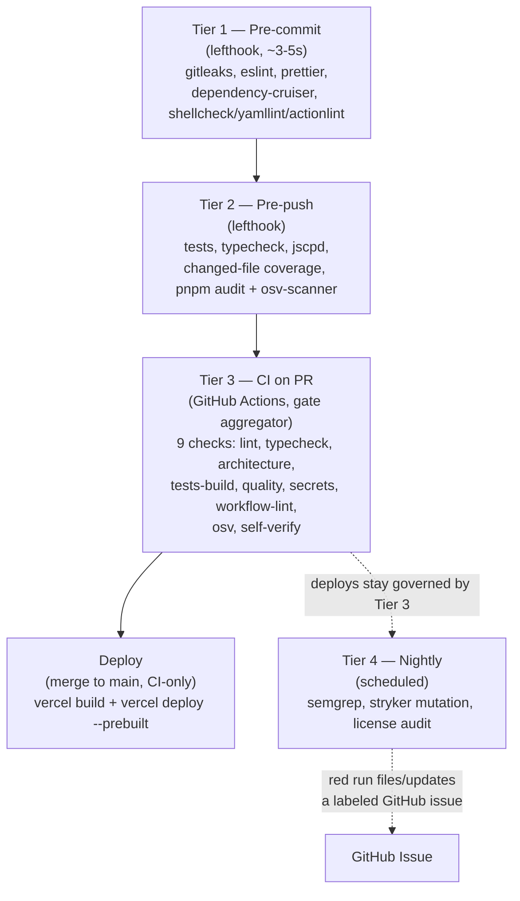

# Deploy Shield

[](https://github.com/korabeland/deploy-shield/actions/workflows/ci.yml)
[](LICENSE)

> Badge URLs above point at `korabeland/deploy-shield`, the template's own repo. **After cloning, update the `OWNER/REPO` in both badge URLs to your new repo** — see the maintainer checklist below.

AI agents meet whatever quality bar you set. The pipeline *is* the bar: Deploy Shield is a reusable **GitHub template repository** for TypeScript monorepos that enforces a layered set of quality gates — pre-commit, pre-push, CI, and nightly — with auto-deploy disabled everywhere so that **CI is the only path to production**. No green, no deploy.

## The four gate tiers



## Quickstart

1. Click **Use this template** on GitHub (or `degit`/clone this repo).
2. Bootstrap the clone:
   ```bash
   scripts/setup.sh
   ```
   or manually:
   ```bash
   mise install && pnpm install && lefthook install
   ```
3. `scripts/setup.sh` also imports the branch-protection ruleset, prompts for Vercel secrets, and creates the nightly-failure label — see [Vercel setup](#vercel-setup) below.

## What runs where

| Tier | Trigger | Jobs |
|---|---|---|
| Pre-commit (`lefthook.yml`) | Every local commit | `gitleaks`, `eslint`, `prettier`, `dependency-cruiser`, `shellcheck` / `yamllint` / `actionlint` (glob-gated) |
| Pre-push (`lefthook.yml`) | Every local push | `test`, `typecheck`, `jscpd`, `changed-coverage`, `audit` (`pnpm audit --audit-level high`), `osv-scanner` |
| CI on PR (`.github/workflows/ci.yml`) | Every PR + push to `main` | `lint`, `typecheck`, `architecture`, `tests-build`, `quality`, `secrets`, `workflow-lint`, `osv`, `self-verify` — all required via the `gate` aggregator |
| Nightly (`.github/workflows/nightly.yml`) | Scheduled (03:00 UTC) + manual dispatch | `semgrep`, `mutation` (Stryker, per-package matrix), `licenses` — a red run files/updates a deduplicated `nightly-failure` issue |

## Thresholds

Every threshold lives in a visible config file, never hardcoded in a script.

| Threshold | Value | File |
|---|---|---|
| Changed-file coverage | 85% | `package.json` → `deployShield.changedFileCoverage` |
| Duplication | <3% | `.jscpd.json` → `threshold` |
| Mutation score (visible bar) | `high: 80` | `packages/contracts/stryker.config.json`, `services/example-service/stryker.config.json` → `thresholds.high` |
| Mutation score (failure line) | `break: 70` | same files → `thresholds.break` — **documented ratchet: raise `break` 70 → 80 once the score is stable**, matching `high` |
| Lint warnings | 0 | `lint` script in `package.json` (`eslint . --max-warnings 0`) |
| Dependency audit severity | `high` | `lefthook.yml` pre-push `audit` job (`pnpm audit --audit-level high`) |
| License allowlist | see below | `.github/workflows/nightly.yml` → `licenses` job, `ALLOWED_LICENSES` env |

## Adding a service

Copy `services/example-service` to `services/<your-service>`. A service may import `@deploy-shield/contracts` and its own code — nothing else. `dependency-cruiser` (`.dependency-cruiser.cjs`) enforces this as a hard error: cross-service imports and imports of any `packages/*` other than `contracts` both fail the `architecture` gate. Give the new service its own `stryker.config.json` and `vitest.config.ts`, matching the ones already in `services/example-service`.

Services integrate with each other over HTTP against the shapes published in `packages/contracts`, never by importing each other's source.

## Database-per-service

Database-per-service is a documented **convention**, not something v1's tooling enforces — carried over from SPEC.md. Nothing in the gates checks for it; keep each service's persistence isolated by discipline.

## Vercel setup

- Secrets: `VERCEL_TOKEN` (repo secret). Variables: `VERCEL_ORG_ID`, `VERCEL_PROJECT_ID`. `scripts/setup.sh` prompts for all three.
- Vercel's **git auto-deploy integration must stay OFF**. `services/example-service/vercel.json` sets `"git": {"deploymentEnabled": false}` declaratively — this survives someone later reconnecting the git integration in the dashboard; the dashboard toggle alone does not.
- Preview deploys run on every PR push; since the Vercel bot doesn't comment on CLI-driven deploys, the workflow posts/updates a sticky PR comment with the preview URL itself.
- Production deploys are triggered by the CI workflow completing successfully on `main` (a `workflow_run` trigger, not `push`) — this makes "no green, no deploy" structural even for ruleset-bypassing pushes.
- **Org-owned repos**: `gitleaks-action` requires a `GITLEAKS_LICENSE` secret for organization-owned repositories (personal-account repos are exempt). Set it before the `secrets` CI job will run cleanly on an org repo.

## GUI git client PATH gotcha

lefthook hooks launched by GUI git clients (e.g. some IDE integrations, GUI Git apps) often run with a minimal `PATH` that excludes mise's shim directory. If a hook reports a tool as "missing" even though `mise install` succeeded, add mise's shims to that client's `PATH`, or run `eval "$(mise activate zsh)"` (adjust for your shell) in the environment the client launches from.

## Documented limitations

- **No update propagation to clones.** GitHub's template mechanism copies files once, at clone time. There is no mechanism that pushes later template changes into existing clones — releases (`CHANGELOG.md` + GitHub releases) are the only signal that a clone is behind.
- **Branch-protection rulesets need a public repo or a paid plan on private repos.** Classic branch protection has the identical constraint, so there is no free fallback. `scripts/setup.sh` detects the 403/422, warns, and skips that step — every other step still completes.
- **No quality-trend dashboard.** This is the one real loss from not using a hosted product like SonarCloud; metrics exist per-run in CI logs/artifacts only.

## Maintainer checklist (repo metadata, not cloneable)

GitHub template settings don't clone with the repo — re-apply these after "Use this template":

- Mark the new repo as a **Template repository** (or unmark, for a normal downstream project) in Settings.
- Set topics: `template-repository`, `typescript`, `monorepo`, `ci-cd`, `quality-gates`, `ai-generated-code`.
- Set a social-preview image.
- Update the badge `OWNER/REPO` at the top of this README to the new repo's path.
- Keep one deliberately-broken demo PR open (fake secret + cross-service import) showing the red `gate` check as a live demo.
- Cut a GitHub release with a matching `CHANGELOG.md` entry for each version bump.

See [SPEC.md](SPEC.md) for the full design and locked decisions, [AGENTS.md](AGENTS.md) for the rules every downstream agent must follow, and [docs/maintaining.md](docs/maintaining.md) for template-authoring guidance.
